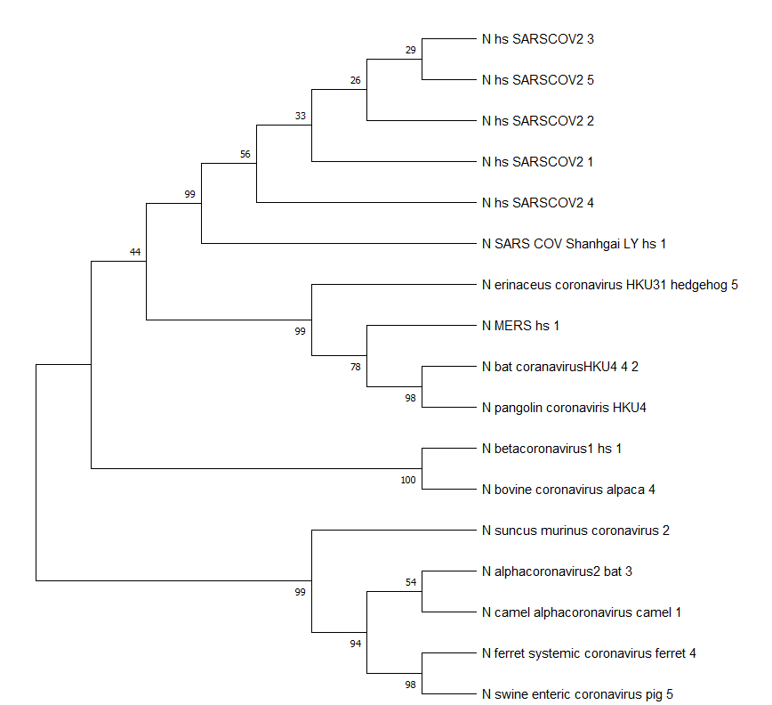
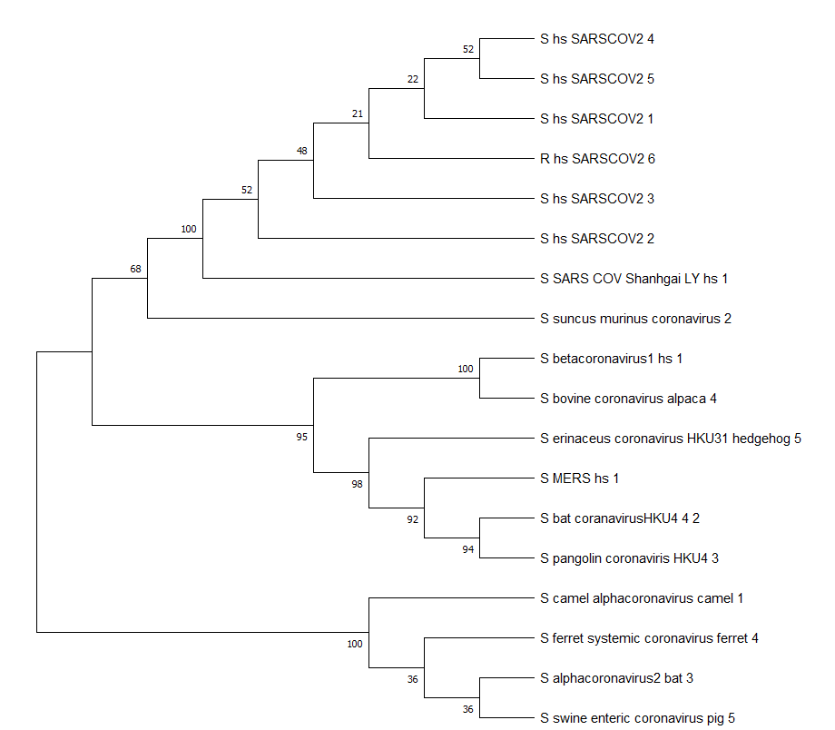
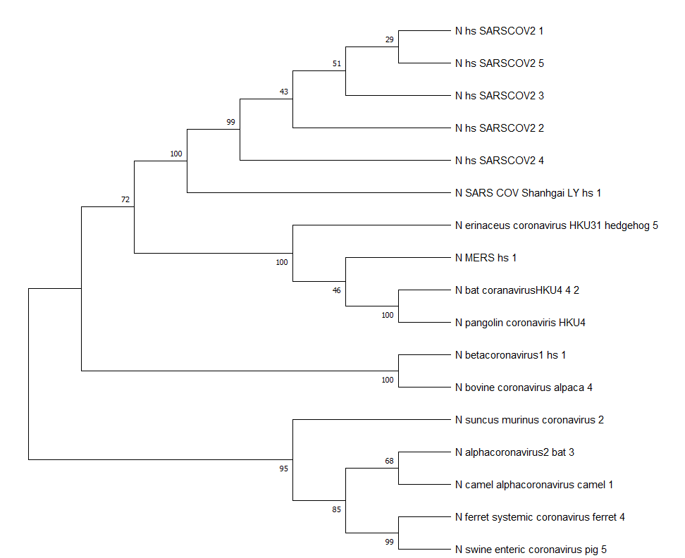
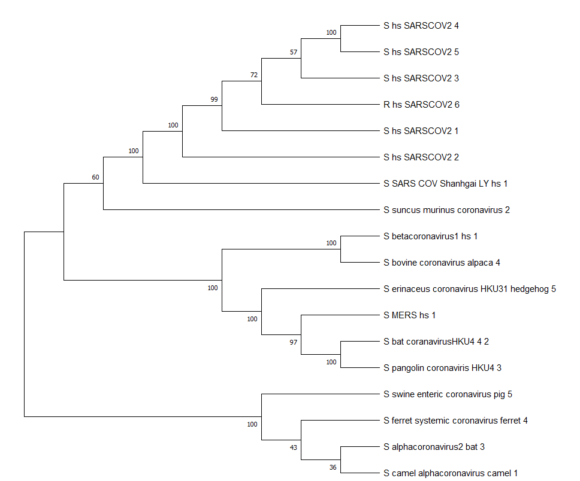
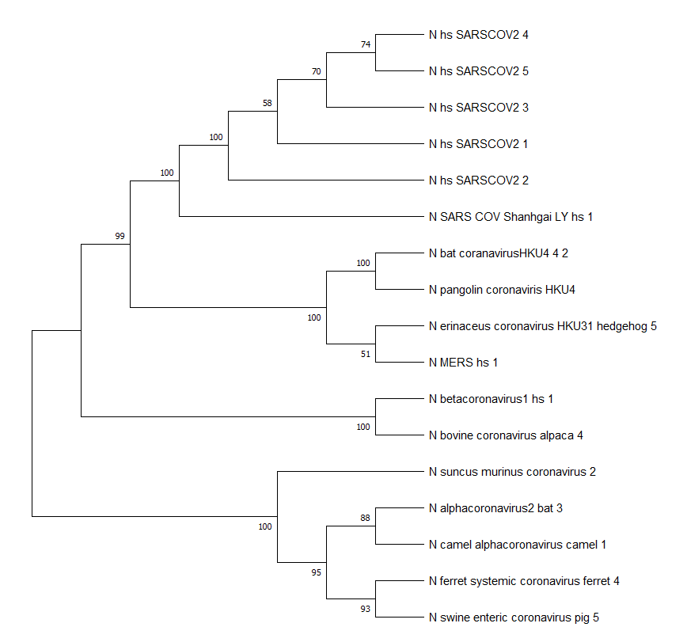
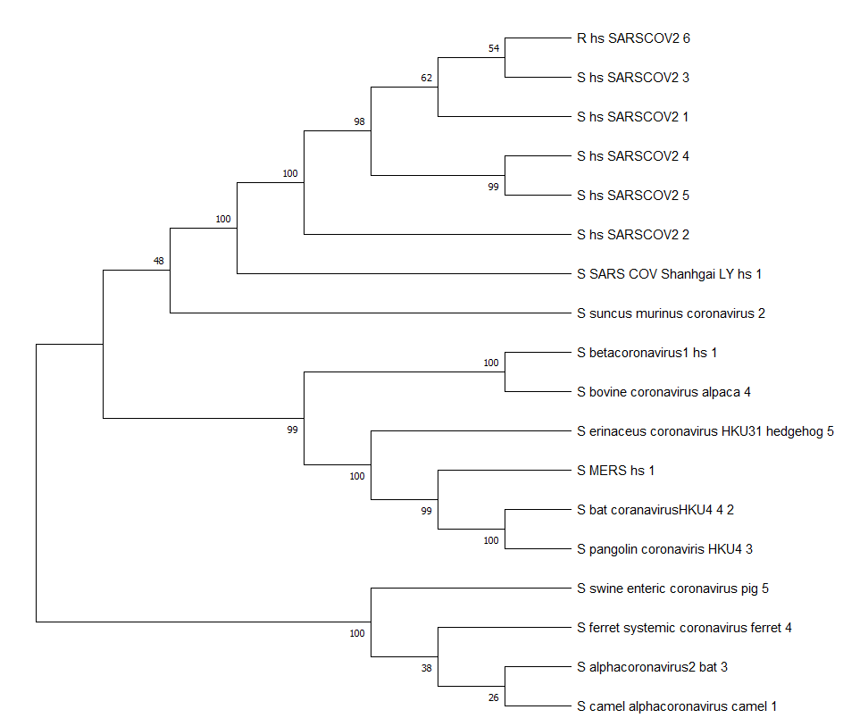
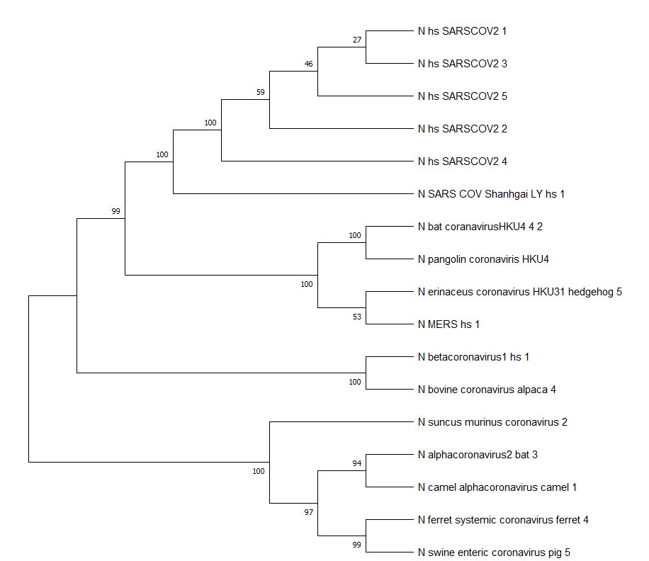
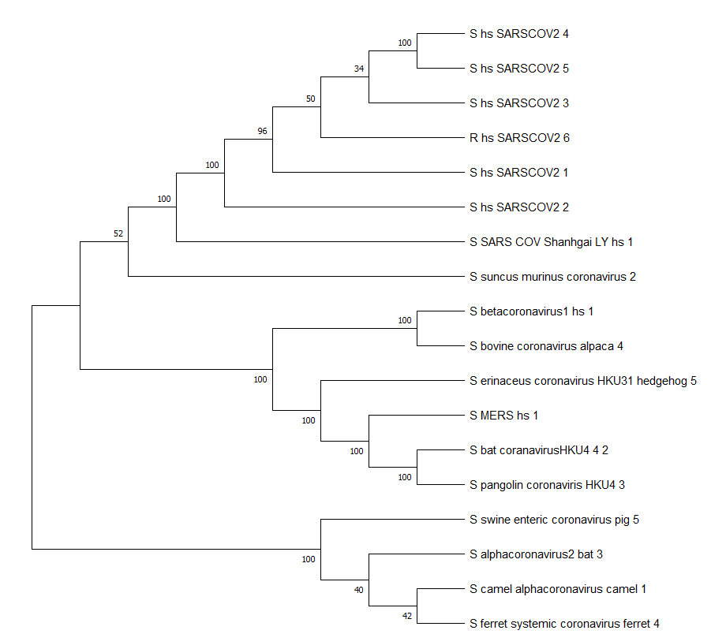

# Исследование происхождения SARS-CoV-2

## Введение
В рамках исследования были выбраны два гена коронавирусов: **S (spike)** и **N (nucleocapsid)**. Ген **S** кодирует белок, играющий ключевую роль в процессе проникновения вируса в клетку хозяина, что делает его важным для изучения механизмов заражения и специфичности хозяина. Ген **N** участвует в упаковке вирусного РНК-генома, а также имеет диагностическое значение, что обуславливает его интерес с точки зрения сравнительной филогенетики.

## Материалы и методы
Для анализа были собраны последовательности генов **S** и **N** у коронавирусов рода *Betacoronavirus* и *Alphacoronavirus*. Список анализируемых последовательностей представлен в таблице ниже.

| Род             | Таксон                        | ID        | Страна        | Дата          | Ген N | Ген S | Хозяин           |
|------------------|-------------------------------|-----------|---------------|---------------|-------|-------|------------------|
| Бетакоронавирус | SARS-CoV-2                   | MW406793  | США           | 19.03.2020    | +     | +     | *Homo sapiens*   |
| Бетакоронавирус | SARS-CoV-2                   | MW023490  | США           | 31.08.2020    | +     | +     | *Homo sapiens*   |
| Бетакоронавирус | SARS-CoV-2                   | MT614481  | США           | 15.03.2020    | +     | +     | *Homo sapiens*   |
| Бетакоронавирус | SARS-CoV-2                   | ON080531  | Швеция        | 03.2020       | -     | +     | *Homo sapiens*   |
| Бетакоронавирус | SARS-CoV-2                   | MW913369  | Австрия       | 06.04.2021    | +     | +     | *Homo sapiens*   |
| Бетакоронавирус | SARS-CoV-2                   | MW428253  | Тунис         | 01.04.2020    | +     | +     | *Homo sapiens*   |
| Бетакоронавирус | betacoronavirus-1            | MH685718  | Уганда        | 2013          | +     | +     | *Homo sapiens*   |
| Бетакоронавирус | bat coronavirus HKU 4-4      | EF065508  | Китай         | 2007          | +     | +     | *Microchiroptera*|
| Бетакоронавирус | pangolin coronavirus HKU 4   | OQ297693  | Китай         | 2020          | +     | +     | *Pholidota*      |
| Бетакоронавирус | bovine coronavirus           | DQ925164  | США           | 2007          | +     | +     | *Lama pacos*     |
| Бетакоронавирус | erinaceus coronavirus        | OM451212  | Китай         | 2020          | +     | +     | *Erinaceinae*    |
| Бетакоронавирус | MERS                         | KJ156939  | Саудовская Аравия | 2013      | +     | +     | *Homo sapiens*   |
| Бетакоронавирус | SARS-CoV-1                   | AH012999  | Китай         | 2016          | +     | +     | *Homo sapiens*   |
| Альфакоронавирус| Camel coronavirus            | NC_028752 | Саудовская Аравия | 03.2015   | +     | +     | *Camelus*        |
| Альфакоронавирус| Suncus murinis coronavirus   | KY967715  | Китай         | 2015          | +     | +     | *Suncus murinus* |
| Альфакоронавирус| Alphacoronavirus-2           | OQ715772  | Китай         | 2023          | +     | +     | *Microchiroptera*|
| Альфакоронавирус| Ferret systemic coronavirus  | KX512810  | США           | 2015          | +     | +     | *Mustela furo*   |
| Альфакоронавирус| Swine enteric cirinavirus    | MT821905  | Италия        | 04.03.2019    | +     | +     | *Suidae*         |

### Подготовка данных
Скрипт `merge.ipynb` объединил последовательности генов **N** и **S** в два отдельных файла: 
- **N.fasta**, содержащий последовательности для гена **N**;
- **S.fasta**, содержащий последовательности для гена **S**.

### Множественное выравнивание
Для выравнивания последовательностей была использована программа **MEGA X 11** с алгоритмом **MUSCLE**. Это позволило создать качественные выравнивания для обоих генов.

### Анализ длины последовательностей
Анализ длины последовательностей, выполненный с помощью скрипта `lengths_sequences.ipynb`, показал, что для гена **N** максимальное отношение длин составляет 1.22, а для гена **S** — 1.28. В обоих случаях различия превышают 20%. Поэтому для дальнейшего анализа выравнивания были обработаны в **Gblocks 0.91b** с использованием настроек для менее строгого отбора, что позволило сохранить максимально возможное количество информативных позиций.

### Анализ моделей эволюции
Подбор оптимальных моделей эволюции нуклеотидов выявил:
- для гена **N** лучшей моделью является Hasegawa-Kishino-Yano с гамма-распределением (HKY + G);
- для гена **S** — General Time Reversible с гамма-распределением и инвариантными сайтами (GTR + G + I).

Сравнение частот замен для одной и той же модели между двумя генами выявило значительные различия. Это говорит о том, что гены **N** и **S** обладают разными эволюционными сигналами, что делает объединение их данных для дальнейшего анализа нецелесообразным.

## Построение филогенетических деревьев

Для каждого гена (**N** и **S**) были построены филогенетические деревья двумя методами: **Neighbor Joining (NJ)** и методом **максимального правдоподобия (Maximum Likelihood, ML)**. 

Анализ проводился как для нуклеотидных, так и для белковых последовательностей. Построенные деревья подтвердили все основные наблюдения, полученные на основе анализа нуклеотидных последовательностей.

### Белковые последовательности
Для белковых последовательностей также были подобраны оптимальные эволюционные модели:
- Для гена **N** методом ML использовалась модель Whelan and Goldman (WAG + I). Для оценки надежности использовался bootstrap-анализ с 200 повторениями.
- Для гена **S** методом ML использовалась модель LG с гамма-распределением, инвариантными сайтами и учётом частот (LG + G + I + F). Из-за ограничений вычислительных мощностей bootstrap-анализ был выполнен с 50 повторениями.

### Укоренение деревьев
Во всех построенных деревьях (для нуклеотидных и белковых последовательностей) укоренение выполнялось так, чтобы представители рода *Alphacoronavirus* формировали отдельный кластер. Это позволило корректно выделить кластеры между представителями родов *Betacoronavirus* и *Alphacoronavirus*.

### Сводная таблица деревьев
| Метод/Ген | Ген N                            | Ген S                            |
|-----------|----------------------------------|----------------------------------|
| NJ (ДНК)  |  |  |
| ML (ДНК)  |  |  |
| NJ (белок)|  |  |
| ML (белок)|  |  |

## Анализ филогенетических деревьев

### Общие наблюдения
- Построенные деревья продемонстрировали хорошую кластеризацию для основных групп коронавирусов:
  - **SARS-CoV-2** формирует четкий кластер, отдельный от других представителей рода *Betacoronavirus*.
  - Представители рода **Alphacoronavirus** также образуют отчетливую группу.
  - Другие *Betacoronavirus*, включая MERS-CoV и SARS-CoV-1, группируются согласно эволюционным связям.

### Надежность кластеров
- Для крупных групп (*Betacoronavirus*, *Alphacoronavirus*, SARS-CoV-2) показатели bootstrap-анализов высоки (близки к 100), что подтверждает достоверность выделенных кластеров.
- Внутри кластеров степень уверенности ниже, что свидетельствует о возможной гетерогенности последовательностей внутри группы.

### Интересные находки
- Для гена **S** наблюдается неожиданное явление: последовательность **suncus murinus coronavirus** оказалась ближе к кластеру **SARS-CoV-2**, несмотря на то, что этот вирус классифицируется как представитель рода *Alphacoronavirus*. Возможные объяснения включают:
  - **Конвергентная эволюция**, вызванная схожими селективными давлениями.
  - **Рекомбинация**, характерная для коронавирусов.
- Для гена **N** такой картины не наблюдается: последовательности группируются строго в соответствии с ожидаемой филогенией, подчеркивая различия в эволюционных процессах между генами.

## Заключение
Результаты подтверждают надежность методов построения деревьев для анализа крупных групп коронавирусов. Метод показал, что происхождение SARS-CoV-2 с большой долей вероятности связано с естественными эволюционными процессами в группе Betacoronavirus. Однако неожиданная близость последовательности **suncus murinus coronavirus** к кластеру **SARS-CoV-2** для гена **S** требует дальнейшего изучения.

