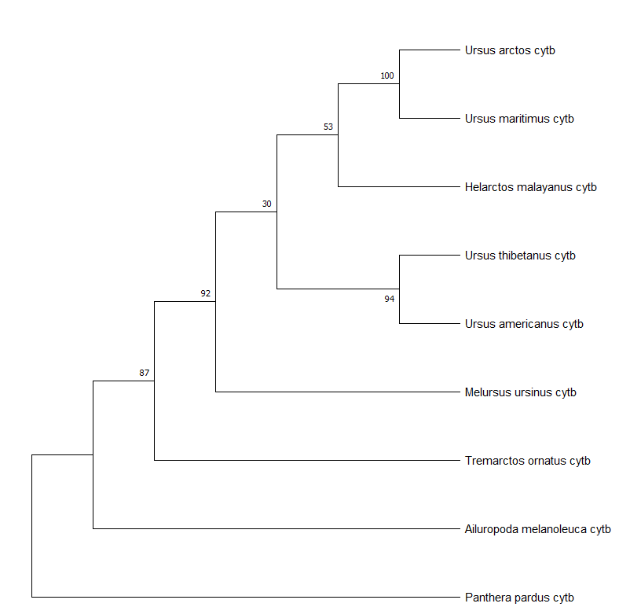
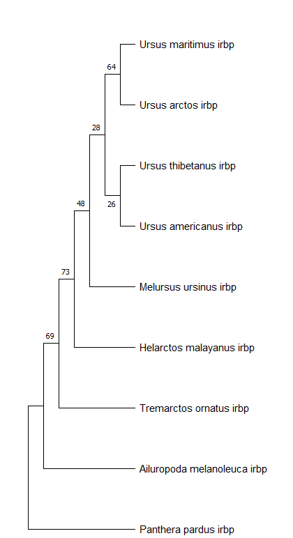

# **Филогенетический анализ представителей Ursidae**

## **Введение**
Семейство Ursidae включает восемь современных видов медведей. Для изучения их эволюционных взаимоотношений были выбраны два гена: ядерный **IRBP** и митохондриальный **CYTB**. Аутгруппой служит леопард (*Panthera pardus*). В данной работе выполнено построение филогенетических деревьев методами максимального правдоподобия (ML) и байесовской оптимизации (BI), что позволяет исследовать особенности эволюции каждого гена.

---

## **Материалы и методы**

### **1. Данные**
Исходные данные были получены из статьи ([Yu et al., 2004](https://pubmed.ncbi.nlm.nih.gov/15223031/)) через Nucleotide. Для каждого гена были добавлены последовательности аутгруппы (*Panthera pardus*).

### **2. Множественное выравнивание**
- **IRBP**: выравнивание выполнено в **MEGA** с использованием утилиты **MUSCLE**, после чего данные обрезаны с помощью **Gblocks 0.91b**.
- **CYTB**: выравнивание выполнено аналогично, обрезание не потребовалось, так как последовательности были одинаковой длины.

### **3. Конвертация данных**
- Выровненные последовательности были преобразованы в формат **NEXUS** с использованием инструмента [Format Converter](https://www.hiv.lanl.gov/content/sequence/FORMAT_CONVERSION/form.html?sample_input=1).

### **4. Выбор модели нуклеотидных замен**
- Для гена **IRBP**: T92+G (Tamura 1992 + Gamma).
- Для гена **CYTB**: HKY+I (Hasegawa-Kishino-Yano + Invariant Sites).

Модели были выбраны с помощью инструмента поиска лучших моделей в **MEGA**.

### **5. Построение деревьев**

#### **Метод максимального правдоподобия (ML)**
- Построение выполнено в **MEGA**.
- Бутстрапирование: 500 репликаций.

#### **Байесовский метод (MrBayes)**
- Построение выполнено в **MrBayes** с использованием следующих параметров:
  - **CYTB:**
    - Модель: HKY+I.
    - Частоты нуклеотидов: A - 0.3, C - 0.32, G - 0.13, T - 0.24.
  - **IRBP:**
    - Модель: T92+G.

---

## **Результаты**

### **Филогенетическое дерево для гена CYTB**
- **Метод ML:**
  
- **Метод BI:**
  

- **Параметры и интерпретация:**
  - Частоты нуклеотидов: A и C доминируют, G встречается реже.
  - Высокое значение kappa (29.8) подтверждает преобладание переходов над трансверсиями.
  - ESS (8383) указывает на отличную сходимость цепей.
  - LnL (-4735) свидетельствует о хорошем правдоподобии модели.

---

### **Филогенетическое дерево для гена IRBP**
- **Метод ML:**
  
- **Метод BI:**
  

- **Параметры и интерпретация:**
  - Частоты оснований: C и G равны, A и T встречаются реже.
  - Gamma-параметр указывает на значительную вариабельность скоростей между сайтами.
  - ESS (9693) подтверждает хорошую сходимость.
  - LnL (-2365) свидетельствует о качестве модели.

---

## **Обсуждение**
Анализ параметров и филогенетических деревьев показал следующие особенности:
1. **CYTB:**
   - Высокая поддержка узлов как в методе ML, так и BI.
   - Преобладание переходов (kappa = 29.8) подтверждает митохондриальную природу гена.
   - Сходимость цепей и качество модели подтверждены высокими значениями ESS (8383) и lnL (-4735).
2. **IRBP:**
   - Более низкая поддержка узлов в BI дереве по сравнению с ML.
   - Преобладание C и G, характерное для ядерных генов.
   - Gamma-параметр подтверждает вариабельность между сайтами.
   - Сходимость цепей и правдоподобие модели также на хорошем уровне (ESS = 9693, lnL = -2365).

Байесовский анализ добавляет уверенности в оценках топологии деревьев, подтверждая результаты ML. Для CYTB отмечена большая стабильность узлов.
