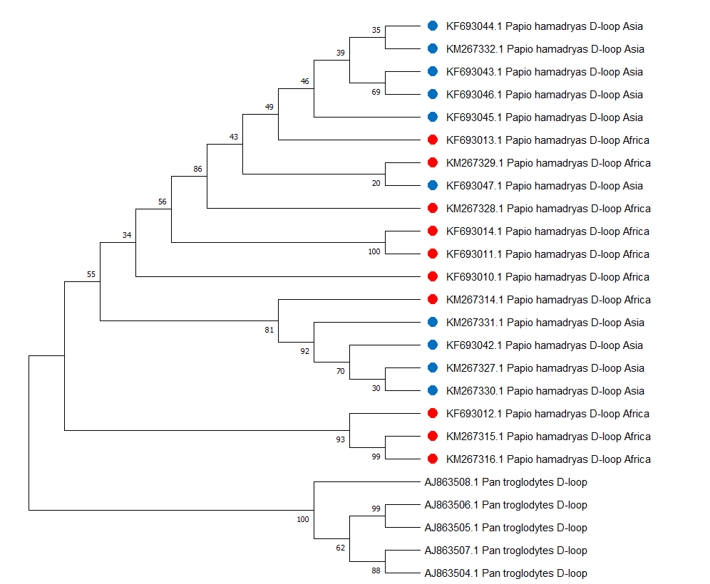
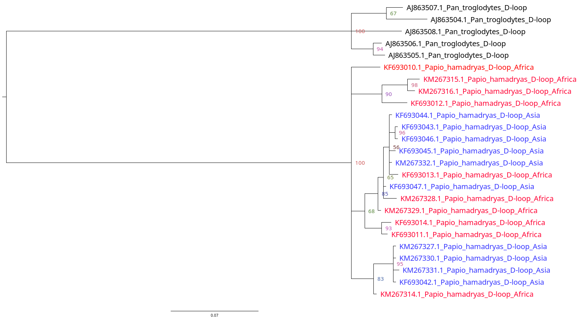

# Исследование популяционной структуры плащеносных павианов

## Введение
Плащеносные павианы (Papio hamadryas) живут в двух обособленных ареалах обитания: на востоке Африки и на Аравийском полуострове. Предполагается, что эти популяции разошлись около 200 тысяч лет назад, когда Красное море стало естественным барьером для миграций.

Для анализа генетической структуры популяций я использовал **митохондриальный участок D-loop**, который часто применяется для изучения генетической вариабельности из-за высокой скорости мутаций и отсутствия рекомбинации.

## Материалы и методы

### Сбор данных
Мы использовали данные из базы **NCBI Nucleotide**, включив последовательности:
- 10 павианов из восточной Африки,
- 10 павианов с Аравийского полуострова,
- 5 шимпанзе, выбранных в качестве аутгруппы.

### Выравнивание
Для выравнивания последовательностей был использован алгоритм **MUSCLE** в программе **MEGA**. В результате выравнивания образовались висячие хвосты, которые были обрезаны с помощью **Gblocks** для удаления неинформативных позиций.

### Выбор модели эволюции
С помощью MEGA была подобрана модель нуклеотидных замен — **HKY + I** (модель Хасегавы-Кишино-Яно с долей инвариантных сайтов).

### Построение ML-дерева
Я построил дерево максимального правдоподобия (**ML**) с поддержкой бутстрепа (500 итераций). Результаты показали:
- Хорошую кластеризацию аутгруппы (шимпанзе),
- Низкую уверенность в узлах, что потребовало использования более точного метода.

### Построение дерева с байесовским подходом
Для повышения точности я использовал **MrBayes**. Запуск выполнен с параметрами:
- Модель: HKY + I,
- Количество итераций: 1,000,000,
- Burn-in: 25%,
- Chain length: 4,
- Starting tree: random.

Уверенность в узлах значительно улучшилась, о чем свидетельствуют значения `prob` в консенсусном дереве.

### Метрики результата
- Логарифм правдоподобия (**LnL**) = -1324,
- Эффективный размер выборки (**ESS**) = 3950,
- Коэффициент транзиции/трансверсии (**kappa**) = 7.6,
- Частоты нуклеотидов: A = 0.35, T = 0.25, G = 0.1, C = 0.3.

## Результаты и обсуждение
- Байесовский подход показал **лучшее разрешение узлов**, чем ML-метод.
- Несмотря на отсутствие полного разделения павианов на две популяции, наблюдается частичная группировка по ареалам обитания.
- Эти данные могут указывать на недавние миграции между Африкой и Аравийским полуостровом или сохранение общей генетической вариабельности из-за недавнего расхождения.

---

**Заключение:**
Методы филогенетического анализа, включая ML и байесовский подход, позволяют изучать генетическую структуру популяций. Однако для более точной оценки уровня дивергенции между популяциями рекомендуется дополнить анализ методами, учитывающими демографическую историю (например, AMOVA или гаплотипические сети).
